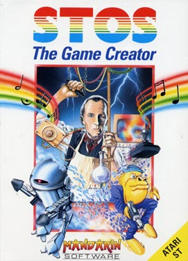

# STOS Basic Language Support
Syntax support for the STOS Basic language from the Atari ST, along with popular extensions such as Misty, Missing Link and Ninja Tracker.  
## Features
- Syntax highlighting
- Autocompletion
- Command hints
- STOS colour theme

# STOS: The Game Creator
  
**Created by**  
Francois Lionet  

**Published by**  
Mandarin Software    

# STOS Basic Language Support for Visual Studio Code
**Created and Developed by**  
Neil Halliday  
  
**Beta Testing by**  
Geoff Harrison  
Bruno Azzara  
Michael Keenleyside  

  
**https://stoscoders.com**  
**https://facebook.com/groups/stoscoders**      

